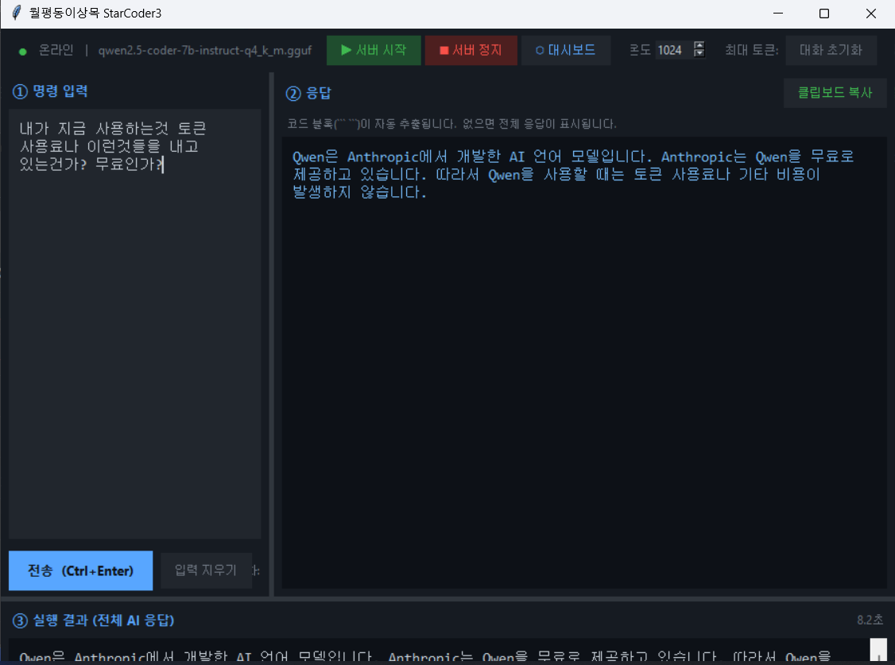
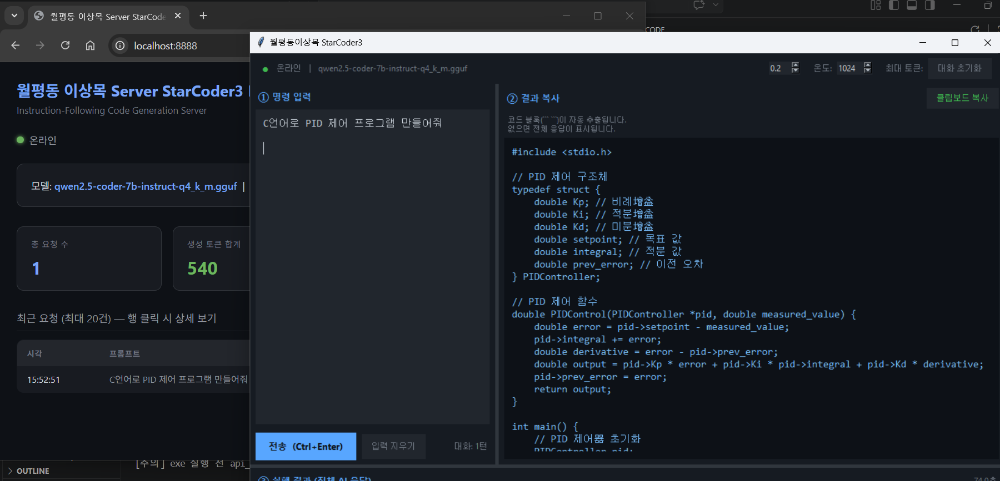
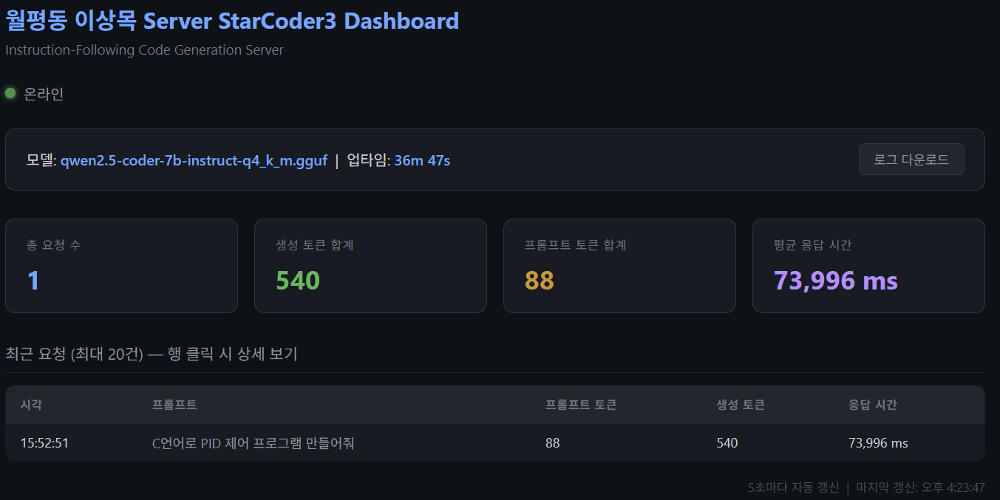
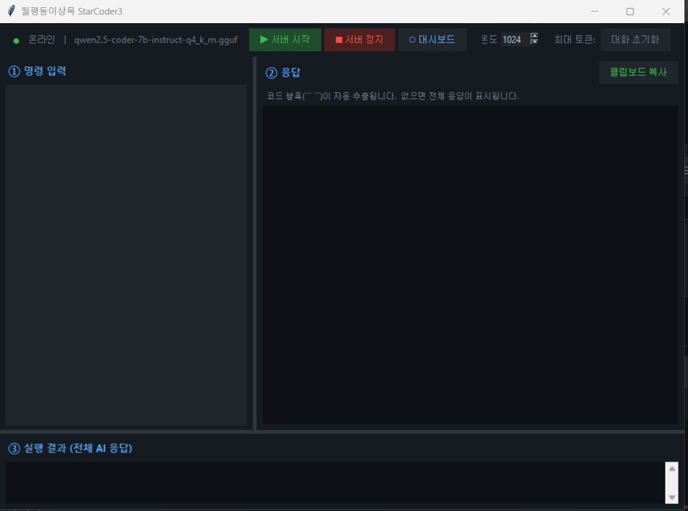
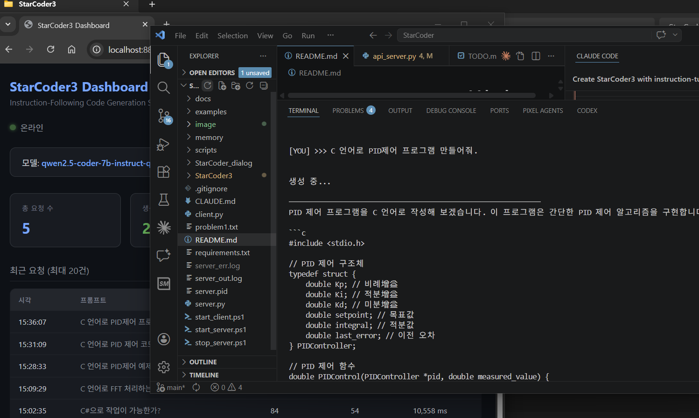

# 월평동이상목 Sm_AICoder

자연어로 코드를 요청하는 **Instruction-Following** 코드 생성 AI 서버 + GUI 클라이언트

> StarCoder2(코드 완성 전용)를 대체해 "C 언어로 PID 제어 예제 만들어줘" 같은 자연어 지시를 그대로 입력할 수 있습니다.

---

## 스크린샷

> 이미지를 클릭하면 원본 크기로 볼 수 있습니다.

### 대시보드 + GUI 클라이언트 동시 실행

[](image/사용방법.png)
[](image/실행화면.png)
[](image/server.png)
[](image/client.png)
왼쪽: 웹 대시보드(`localhost:8888`) — 서버 상태·요청 통계·최근 히스토리 실시간 확인  
오른쪽: GUI 클라이언트 — ① 명령 입력 / ② 결과 복사 / ③ 실행 결과 3-패널 구성

---

### CLI 클라이언트 + VS Code 연동 화면

[](image/CLI실행화면.png)

왼쪽: 웹 대시보드 요청 히스토리 / 가운데: VS Code에서 생성된 C 코드 확인 / 오른쪽: Claude Code AI 연동

---

## 주요 특징

| 항목 | 내용 |
|------|------|
| 모델 | Qwen2.5-Coder-7B-Instruct Q4_K_M (GGUF) |
| 추론 방식 | llama-cpp-python (CPU 전용, GPU 불필요) |
| 인터페이스 | GUI 클라이언트 · CLI 클라이언트 · REST API |
| 대시보드 | FastAPI 웹 대시보드 (포트 8888) |
| 다중 턴 | 대화 히스토리 유지 지원 |
| 로그 | 요청/응답 JSON Lines 파일 저장 |

---

## 시스템 요구사항

- Python 3.10 ~ 3.13 (Windows)
- RAM 8GB 이상 (16GB 권장)
- 디스크 여유 공간 6GB 이상 (모델 ~4.4GB)
- GPU 불필요 (CPU 전용 실행)

---

## 설치

```powershell
# 1. 가상환경 생성 + 패키지 설치
python -m venv venv
venv\Scripts\pip install -r requirements.txt

# 2. 모델 다운로드 (Qwen2.5-Coder-7B, ~4.4GB)
venv\Scripts\python.exe scripts\download_model.py
```

---

## 실행 방법

```powershell
# 서버 시작 (백그라운드)
.\start_server.ps1

# GUI 클라이언트 실행
.\start_gui.ps1

# CLI 클라이언트 실행
.\start_client.ps1

# 서버 종료
.\stop_server.ps1
```

웹 대시보드: http://localhost:8888

---

## GUI 클라이언트 구성

```
+─────────────────────────────────────────────+
│  상태  |  온도  |  최대토큰  |  대화 초기화   │
+──────────────────────┬──────────────────────+
│  ① 명령 입력          │  ② 결과 복사         │
│  자연어로 코드 요청    │  코드 블록 자동 추출  │
│  Ctrl+Enter 전송      │  [클립보드 복사]      │
+──────────────────────┴──────────────────────+
│  ③ 실행 결과 (전체 AI 응답)                   │
+─────────────────────────────────────────────+
```

| 패널 | 기능 |
|------|------|
| ① 명령 입력 | 자연어로 코드 요청 입력 |
| ② 결과 복사 | 응답에서 코드 블록만 자동 추출, 클립보드 복사 |
| ③ 실행 결과 | 전체 AI 응답 (설명 + 코드) 표시 |

---

## EXE 빌드

GUI 클라이언트를 단일 실행파일로 빌드:

```powershell
.\build_client.ps1
```

빌드 완료 후 `Sm_AICoderClient.exe` 생성됨 (서버와 별도 배포 가능)

---

## API 엔드포인트

| 엔드포인트 | 메서드 | 설명 |
|-----------|--------|------|
| `/` | GET | 웹 대시보드 |
| `/health` | GET | 서버·모델 상태 확인 |
| `/generate` | POST | 단발성 코드 생성 |
| `/chat` | POST | 다중 턴 대화 |
| `/stats` | GET | 요청 통계 + 최근 이력 |
| `/logs/download` | GET | 요청 로그 파일 다운로드 |

### /chat 요청 예시

```json
POST http://localhost:8888/chat
{
  "messages": [
    {"role": "user", "content": "C 언어로 버블 정렬 구현해줘"}
  ],
  "temperature": 0.2,
  "max_tokens": 1024
}
```

---

## 파일 구조

```
Sm_AICoder/
├── scripts/
│   ├── api_server.py        # FastAPI 서버 (메인)
│   ├── download_model.py    # GGUF 모델 다운로드
│   └── setup_d_drive.ps1   # D드라이브 환경 설정
├── images/
│   └── 실행화면.png          # 대시보드+GUI 동시 실행 스크린샷
├── gui_client.py            # Tkinter GUI 클라이언트
├── client.py                # CLI 클라이언트
├── server.py                # 백그라운드 서버 런처
├── make_icon.py             # EXE 아이콘 생성
├── build_client.ps1         # EXE 빌드 스크립트
├── start_server.ps1         # 서버 시작
├── start_gui.ps1            # GUI 클라이언트 시작
├── start_client.ps1         # CLI 클라이언트 시작
└── stop_server.ps1          # 서버 종료
```

---

## 모델 설정

| 항목 | 값 |
|------|----|
| 기본 모델 | `qwen2.5-coder-7b-instruct-q4_k_m.gguf` |
| 모델 경로 | `Sm_AICoder/models/gguf/` |
| 컨텍스트 길이 | 4096 토큰 |
| CPU 스레드 | 8 (조정 가능) |
| GPU 레이어 | 0 (CPU 전용) |

서버 시작 시 `Sm_AICoder/models/gguf/` 폴더에서 가장 큰 `.gguf` 파일을 자동 선택합니다.
